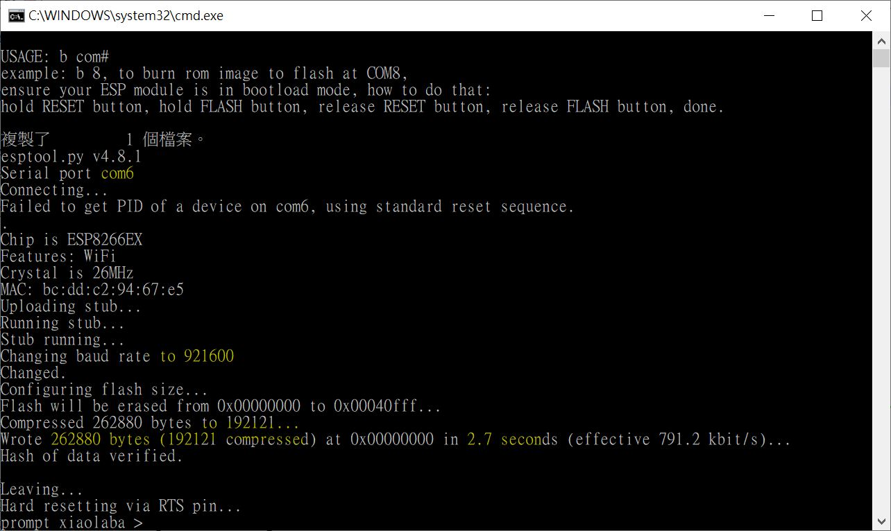

Update by xiaolaba, 2026-JUN-13
hardware : LoLin NodeMCU V3 or clone, serial chip CH340G, or ESP-12 or those clone.
           baud rate 921600, set CPU 80MHZ, 4M no SPIFF
uses esptool4.8.1.exe, 
download,
https://docs.espressif.com/projects/esp-test-tools/en/latest/esp8266/production_stage/tools/flash_download_tool.html

rewrite b.bat, auto reset and uploading, testing done.
try combinding firmware files
testing done.


burn the chip as COM6 is ready.
```
b 6
```

  


